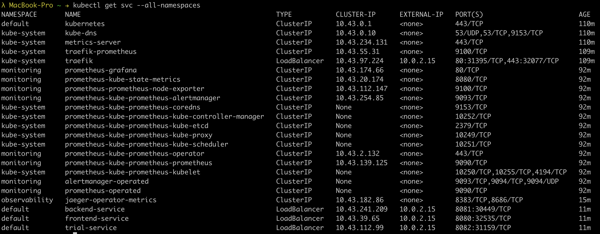

**Note:** For the screenshots, you can store all of your answer images in the `answer-img` directory.

## Verify the monitoring installation

*TODO:* run `kubectl` command to show the running pods and services for all components. Take a screenshot of the output and include it here to verify the installation

✅ DONE




## The README has a screenshot showing the home page after login

✅ DONE


## Setup the Jaeger and Prometheus source
*TODO:* Expose Grafana to the internet and then setup Prometheus as a data source. Provide a screenshot of the home page after logging into Grafana.

✅ DONE


## Create a Basic Dashboard
*TODO:* Create a dashboard in Grafana that shows Prometheus as a source. Take a screenshot and include it here.

✅ DONE


## Describe SLO/SLI
*TODO:* Describe, in your own words, what the SLIs are, based on an SLO of *monthly uptime* and *request response time*.

✅ DONE 

### Answer:

#### Monthly Uptime
I would use some health check here, checking the availability and responsiveness of the application on a frequent (e.g. every 30 seconds) basis.
Everytime the application doesn't respond in the time defined in the health check (e.g. 10 seconds) the "downtime timer" starts till the application is healthy again. At the end of the month I compare the time that was counted by the "downtime timer" to the total time passed in the month to see my application uptime in percentage.

#### Request response time
I would use the latency of an user facing application where a fast response is expected. For example a server that delivers data needed by a frontend application. Of course long-running background jobs should be excluded here. 
The latency of the measured server should be measured in milliseconds and a fixed threshold of e.g. 200ms should be defined.
The the end of the month I would compare the amount of requests under 200ms and  the amount of request above 200ms response time to see if I am inside my SLO range (e.g. the 95th percentile of requests needs to be below 200ms).


## Creating SLI metrics.
*TODO:* It is important to know why we want to measure certain metrics for our customer. Describe in detail 5 metrics to measure these SLIs. 

✅ DONE 

### Latency
Latency is the time taken to serve a request (usually measured in ms), aka response time.
This metric is important for our customers to have a smooth experience using e.g. the frontend. Increased latency means that customers needs to wait longer which often results in customers leaving the website or in case of an application the change for them the provider is increased.

### Traffic
The amount of stress on a system from demand (such as the number of HTTP requests/second).
To keep an eye on the traffic is important, because high traffic means that there might be high requirements of CPU / memory / I/O of the system, leading to potential performance decrease or even an outage. Both cases are very bad for customer experience while the later one would be a major incident where customers wouldn't be able to do anything at all anymore.
A sudden increase in traffic might also indicate a potential error in the frontend, e.g. a infinite loop that was triggered and as such DoS'ing the system.

### Errors
The number of requests that are failing (such as number of HTTP 500 responses). A high amount of errors usually indicate poor error handling on application side or use cases that weren't properly thought through and as such the system can't handle them. For customers this means that they might often see error messages and as such the user experience degrades heavily, leading to unhappy customers.

### Saturation

The overall capacity of a service (such as the percentage of memory or CPU used).
High saturation of a system can lead to potential performance decrease or even an outage. Both cases are very bad for customer experience while the later one would be a major incident where customers wouldn't be able to do anything at all anymore.


## Create a Dashboard to measure our SLIs
*TODO:* Create a dashboard to measure the uptime of the frontend and backend services We will also want to measure to measure 40x and 50x errors. Create a dashboard that show these values over a 24 hour period and take a screenshot.

✅ DONE 

Note: I used 30M instead of 24h period, because in a 24h you wouldn't see any changes, since the VM didn't exist that long.
Also the Graph is only showing metrics for one demo application, but I added the following to my boards to make sure that it works for an undefined amount of containers
```
sum by (container) (
    increase(
        flask_http_request_total{status=~"2.+"}[1m]
    )
)
```


## Tracing our Flask App
*TODO:*  We will create a Jaeger span to measure the processes on the backend. Once you fill in the span, provide a screenshot of it here. Also provide a (screenshot) sample Python file containing a trace and span code used to perform Jaeger traces on the backend service.

✅ DONE 


✅ DONE 


## Jaeger in Dashboards
*TODO:* Now that the trace is running, let's add the metric to our current Grafana dashboard. Once this is completed, provide a screenshot of it here.


✅ DONE


## Report Error
*TODO:* Using the template below, write a trouble ticket for the developers, to explain the errors that you are seeing (400, 500, latency) and to let them know the file that is causing the issue also include a screenshot of the tracer span to demonstrate how we can user a tracer to locate errors easily.

✅ DONE

TROUBLE TICKET

**Name:** Pascal Zwikirsch

**Date:** 2021-12-06 15:23:58

**Subject:** `trial-app` | Internal Server Error on `GET /error`

**Affected Area:** `trial-app` (File: `app.py`)

**Severity:** Medium

**Description:**
In todays tracing we identified a few errors that are being triggered on the `/error` route when being hit with a `GET` request.
It appears that every time we trigger the route on the service an `500 Internal Server Error` is returned.
The error can be reproduced by simply triggering the url `http://localhost:30001/error`.

Additional information that could be derived by the logs:
```json
{
    "event": "Error Handler",
    "count": 5
}
```

More information details can be found on attached image:


In case you feel that some information is missing, feel free to reach out.


## Creating SLIs and SLOs
*TODO:* We want to create an SLO guaranteeing that our application has a 99.95% uptime per month. Name four SLIs that you would use to measure the success of this SLO.

✅ DONE

- Request Latency -> How long it takes to return a response to a request
- Error Rate -> How many 5XX are triggered, compared to successful responses
- Availability -> Was there a time the service/system wasn't available/reachable
- Saturation -> Hardware usage CPU / Memory needs to be kept in check to prevent issues


## Building KPIs for our plan
*TODO*: Now that we have our SLIs and SLOs, create a list of 2-3 KPIs to accurately measure these metrics as well as a description of why those KPIs were chosen. We will make a dashboard for this, but first write them down here.

✅ DONE

Referring to https://knowledge.udacity.com/questions/693931 I actually think that the SLIs I mentioned on the previous question are already the KPIs needed here.


## Final Dashboard
*TODO*: Create a Dashboard containing graphs that capture all the metrics of your KPIs and adequately representing your SLIs and SLOs. Include a screenshot of the dashboard here, and write a text description of what graphs are represented in the dashboard.  

✅ DONE

- The "Saturation" is displayed via the "Node Memory usage" and "Node CPU usage" to keep the hardware metrics in track.
- The "Error Rate" is described via the "Error Rate" graph which displays the number of errors divided by the total number of requests
- The "Availability" is described via the "Up Container" and "Unavailabile Replicas" graphs, which displayed the amount of currently running containers and the amount of currently unavailable replicas, indicating a possible downtime
- The "Request Latency" is displayed in the "Request Latency" graph, that shows the average time for a request to respond. Also the "Jaeger" table at the bottom right is also showing the requests being made and their duration.


----
----
----
----
----
# PERSONAL Notes 

```sh
# Set kube context
cat /etc/rancher/k3s/k3s.yaml

# copy&paste this into the root machine at ~/.kube/config

# Install helm
curl -fsSL -o get_helm.sh https://raw.githubusercontent.com/helm/helm/main/scripts/get-helm-3
chmod 700 get_helm.sh
./get_helm.sh

# Install Grafana + Prometheus

kubectl create namespace monitoring
helm repo add prometheus-community https://prometheus-community.github.io/helm-charts
helm repo add stable https://charts.helm.sh/stable
helm repo update
helm install prometheus prometheus-community/kube-prometheus-stack --namespace monitoring --kubeconfig /etc/rancher/k3s/k3s.yaml

# Install Jaeger Tracing

export namespace=observability
export jaeger_version=v1.28.0

kubectl create namespace ${namespace}
kubectl create -f https://raw.githubusercontent.com/jaegertracing/jaeger-operator/${jaeger_version}/deploy/crds/jaegertracing.io_jaegers_crd.yaml
kubectl create -n ${namespace} -f https://raw.githubusercontent.com/jaegertracing/jaeger-operator/${jaeger_version}/deploy/service_account.yaml
kubectl create -n ${namespace} -f https://raw.githubusercontent.com/jaegertracing/jaeger-operator/${jaeger_version}/deploy/role.yaml
kubectl create -n ${namespace} -f https://raw.githubusercontent.com/jaegertracing/jaeger-operator/${jaeger_version}/deploy/role_binding.yaml
kubectl create -n ${namespace} -f https://raw.githubusercontent.com/jaegertracing/jaeger-operator/${jaeger_version}/deploy/operator.yaml

kubectl create -f https://raw.githubusercontent.com/jaegertracing/jaeger-operator/${jaeger_version}/deploy/cluster_role.yaml
kubectl create -f https://raw.githubusercontent.com/jaegertracing/jaeger-operator/${jaeger_version}/deploy/cluster_role_binding.yaml

kubectl create -f https://raw.githubusercontent.com/jaegertracing/jaeger-operator/master/examples/business-application-injected-sidecar.yaml

unset namespace
unset jaeger_version


### See service name and port of jaeger ingress
kubectl get -n observability ingress -o yaml | tail

# Adress for the service to add in data source of grafana
export namespace=observability
ingress_name=$(kubectl get -n ${namespace} ingress -o jsonpath='{.items[0].metadata.name}'); \
ingress_port=$(kubectl get -n ${namespace} ingress -o jsonpath='{.items[0].spec.defaultBackend.service.port.number}'); \
echo -e "\n\n${ingress_name}.${namespace}.svc.cluster.local:${ingress_port}"
unset namespace


# Deploy Application

cd Project_Starter_Files-Building_a_Metrics_Dashboard/manifests
kubectl apply -f app/

# Port forward (Expose) Grafana 
## Note: Port-Forwarding takes control of the terminal session

## Get Grafana pod
kubectl get pod -n monitoring | grep grafana

## Copy the pod name
## Port forward the port of the pod

kubectl port-forward -n monitoring prometheus-grafana-XXX 3000
# kubectl port-forward -n monitoring prometheus-grafana-5cc44d8f4f-hj2gb 3000


# Prometheus UI -> Check "get svc" to get pod name and port
kubectl get svc -n monitoring
kubectl port-forward -n monitoring service/prometheus-kube-prometheus-prometheus 9090


## -> Verify that it's working by navigating to http://localhost:3000/
## Account: admin
## Password: prom-operator

# Jaeger port forwarding
## -> http://127.0.0.1:16686/search
kubectl port-forward -n observability service/simpletest-query --address 0.0.0.0 16686:16686


# Port foward (Expose) application

kubectl port-forward svc/frontend-service 8080:8080

kubectl port-forward svc/backend-service 8081:8081

## -> Verify that it's working by navigating to http://localhost:8080/


## Install jaeger ingress
# -> https://github.com/jaegertracing/jaeger-operator#getting-started
kubectl get -n observability ingress


```

### Docker

```sh
## Build 'backend' image
docker build -f ./Dockerfile -t abszissex/backend:latest . && docker push abszissex/backend:latest

docker build -f ./Dockerfile -t abszissex/frontend:latest . && docker push abszissex/backend:latest

docker build -f ./Dockerfile -t abszissex/trial:latest . && docker push abszissex/trial:latest

## Push Docker image
docker push abszissex/backend:latest
docker push abszissex/frontend:latest


## Run
docker run -it --rm -p 8080:8080 abszissex/trial:latest

## Docker remove dangling images
docker rmi $(docker images --filter "dangling=true" -q --no-trunc)


```


### Restarting pods of a deployment

```sh
## Restart pods of a deployment
kubectl rollout restart deployment frontend-app backend-app trial-app

kubectl rollout restart deployment trial-app


## Restart pods of all deployments
kubectl rollout restart deployment
```


### logs
```
follow logs
kubectl logs -f -n observability simplest-7b9cddf779-pl5rv

### get logs from whole app (all pods)
kubectl logs -l app=trial
```

### Delete pod
```
kubectl delete pod --grace-period=0 --force --namespace [NAMESPACE] [POD_NAME]

### Delete all pods from this project (Need to verify!)
kubectl get pods -n default --no-headers=true | awk '/frontend|backend|trial/{print $1}'| xargs kubectl delete -n default pod --grace-period=0 --force
```

### Example PromQL
```sh
sum by (container, status) (rate(flask_http_request_duration_seconds_count{}[1m]))


## Show 5XX
sum by (container) (rate(flask_http_request_duration_seconds_count{status=~"5.+"}[1m]))

## Show Pod Up
sum by (container) (up{container="trial-app"})

## Unavailable Replicas
sum by (deployment) (kube_deployment_status_replicas_unavailable{deployment="trial-app"})
```